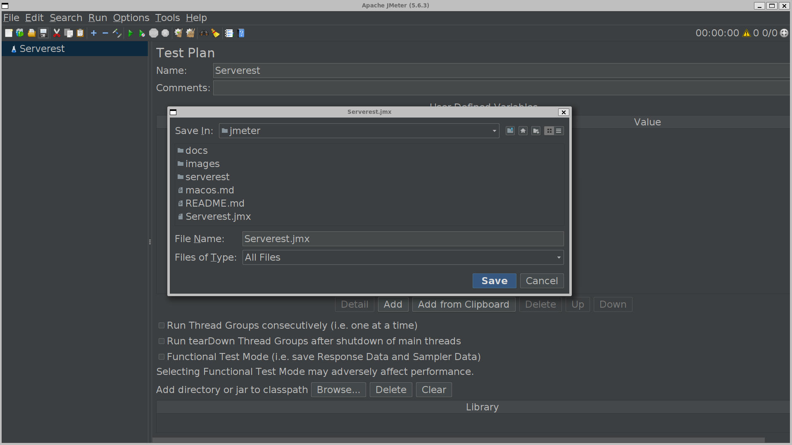

Aqui está a documentação organizada de forma clara e concisa:

---

# Criar Teste no Apache JMeter

Para criar o seu primeiro teste no **Apache JMeter**, siga estas etapas:

---

### 1. **Abrir o JMeter**
   - **Windows**: No prompt de comando, execute o arquivo `jmeter`:
     ```bash
     jmeter
     ```

   - **Linux/macOS**: No terminal, navegue até o diretório onde o JMeter foi extraído e execute:
     ```bash
     ./bin/jmeter
     ```

---

### 2. **Criar um Novo Plano de Teste**
   - **Plano de Teste (Test Plan)** é o componente básico onde você define os testes.
   - Na interface do JMeter, selecione **File > New**, dê o nome ao projeto, por exemplo, `serverest`, e clique em **Save** para salvar o projeto no diretório desejado.

   **No projeto `Serverest`**:
   - Selecione **Add > Threads (Users) > Thread Group**.
   - O **Thread Group** é onde você define o número de usuários virtuais (threads) para simular a carga.

   <div align="center">
     
   </div>

   <div align="center">
     
   </div>

---

### 3. **Configurar o Thread Group**
   O **Thread Group** define os parâmetros do teste, como o número de usuários e a duração:
   - **Número de Threads (Usuários)**: Define quantos usuários virtuais irão realizar o teste (exemplo: 10).
   - **Período de Ramp-Up**: O tempo que o JMeter levará para iniciar todas as threads (exemplo: 10 segundos).
   - **Loop Count**: Número de vezes que cada thread executará o teste (exemplo: 1 ou 10).

   <div align="center">
     
   </div>

---

### 4. **Adicionar um Sampler (Requisição)**
   Agora, defina a requisição que será enviada para o servidor.

   - **Exemplo simples: requisição HTTP**
     - Clique com o botão direito em **Thread Group** > **Add > Sampler > HTTP Request**.
     - **Configuração HTTP Request**:
       - **Server Name or IP**: Insira o domínio ou o IP do servidor (exemplo: `www.exemplo.com`).
       - **Port Number**: Deixe em branco se o servidor usar a porta padrão (80 para HTTP ou 443 para HTTPS).
       - **Method**: Escolha o tipo de requisição, como **GET**, **POST**, etc.
       - **Path**: Caminho para o recurso que deseja acessar no servidor (exemplo: `/pagina-de-exemplo`).

   <div align="center">
     
   </div>

   <div align="center">
     
   </div>

---

### 5. **Adicionar um Listener para Visualizar os Resultados**
   Para visualizar os resultados do seu teste, adicione um **Listener**:

   - Clique com o botão direito em **Thread Group** > **Add > Listener > View Results Tree**.
   - Este listener exibe os resultados detalhados de cada requisição, incluindo sucesso ou falha.

   <div align="center">
     
   </div>

   <div align="center">
     
   </div>

---

### 6. **Rodar o Teste**
   Após configurar o **Thread Group**, **HTTP Request** e **Listener**, clique no ícone de **Play** (seta verde) no topo da interface para rodar o teste. O JMeter começará a enviar requisições e exibirá os resultados no **View Results Tree**.

---

### 7. **Verificar os Resultados**
   No **View Results Tree**, você verá os detalhes das requisições enviadas, incluindo:
   - Tempo de resposta.
   - Código de status HTTP (exemplo: 200 para sucesso).
   - Conteúdo retornado.
   - Isso ajuda a verificar se o seu site ou API está respondendo corretamente.

   <div align="center">
     
   </div>

---

### 8. **Ajustar e Expandir o Teste**
   Agora que você criou seu primeiro teste básico, pode expandi-lo:
   - **Adicionar mais requisições**: Para simular uma navegação mais realista, adicione mais **HTTP Requests** ou outros tipos de Samplers.
   - **Adicionar Assertions**: Para validar se a resposta está correta, adicione **Assertions** (como **Response Assertion**) para verificar o conteúdo da resposta.

---

### 9. **Salvar o Plano de Teste**
   Quando terminar, salve o seu plano de teste clicando em **File > Save** ou pressionando **Ctrl + S**.

---

### Exemplo Completo

Aqui está um resumo rápido da estrutura do seu teste simples:

- **Test Plan**
  - **Thread Group**
    - **HTTP Request** (Configuração: método GET, servidor, e caminho)
    - **View Results Tree**

---

### Dica
Se você quiser realizar testes mais avançados, como testar APIs REST, gerar relatórios de desempenho ou adicionar mais complexidade ao seu teste, explore outros tipos de **Samplers**, **Listeners**, **Pre-Processors** e **Post-Processors** que o JMeter oferece.

---