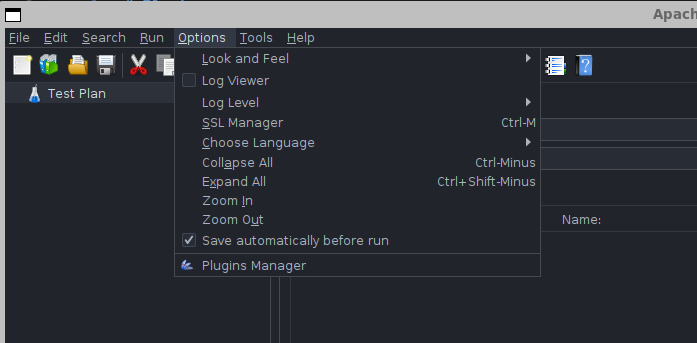
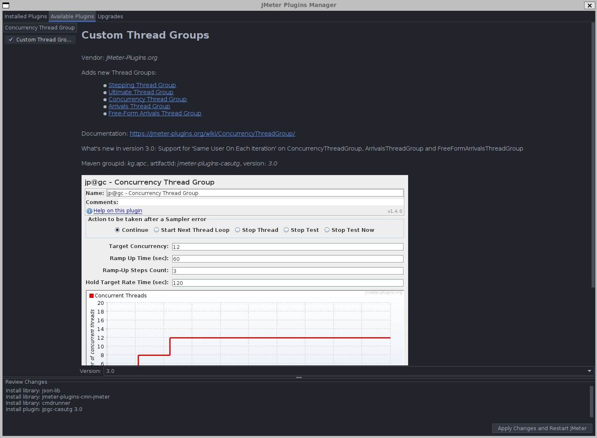

# Plugins

## Instalar o Plugin Manager

1. Acesse o site oficial do [Plugins Manager](https://jmeter-plugins.org/wiki/PluginsManager).
   
2. Baixe o arquivo JAR clicando no link: [JAR file](https://jmeter-plugins.org/get/).

3. Salve o arquivo JAR no diretório do JMETER: `lib/ext/`.

4. Feche e reabra o JMETER.

5. Após reiniciar, a opção "Plugins Manager" aparecerá no menu "Options" do JMETER.

  

---

## Instalar o Concurrency Thread Group

1. Consulte a documentação oficial do [Concurrency Thread Group](https://jmeter-plugins.org/wiki/ConcurrencyThreadGroup/).

2. Abra o "Plugins Manager" e, na barra de pesquisa, procure por: `Concurrency Thread Group`.

  

3. Selecione o plugin desejado e clique em **Apply Changes and Restart JMeter**.

---

Essas melhorias incluem:
- Passos numerados para facilitar a leitura e execução.
- Adição de instruções claras sobre o que fazer após cada etapa.
- Melhor formatação para facilitar a navegação entre as seções.
