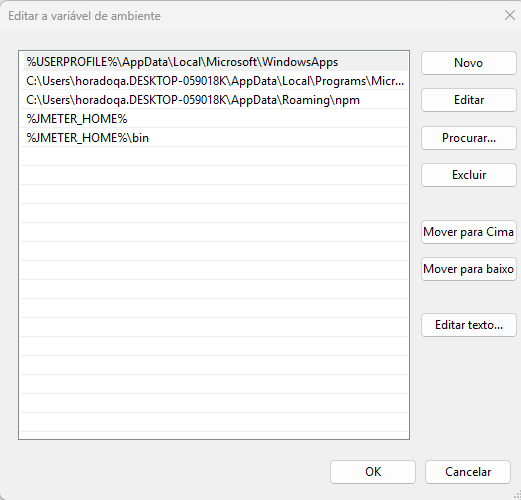

# **Instalação do Apache JMeter no Windows**

### 1. **Baixar o Apache JMeter**
- Acesse a página oficial de downloads do JMeter: [https://jmeter.apache.org/download_jmeter.cgi](https://jmeter.apache.org/download_jmeter.cgi).
- Na seção **"Binaries"**, baixe o arquivo no formato `.zip` (por exemplo, `apache-jmeter-5.x.x.zip`).
- Após o download, copie o arquivo compactado para um diretório de sua escolha, como `C:\Arquivos de Programas`.

### 2. **Extrair o arquivo**
- Navegue até a pasta onde você salvou o arquivo `.zip`.
- Clique com o botão direito do mouse no arquivo e selecione **"Extrair tudo..."**.
- Escolha um diretório para descompactar o arquivo. Por exemplo, `C:\Program Files\jmeter`.

### 3. **Configurar a variável `JMETER_HOME`**
Para garantir que o JMeter funcione corretamente, você precisa configurar a variável de ambiente `JMETER_HOME` e adicionar o diretório `bin` ao `PATH` do sistema.

#### Passos para configurar a variável `JMETER_HOME`:
1. Abra o **Painel de Controle** e clique em **Sistema e Segurança** > **Sistema**.
2. No menu à esquerda, clique em **Configurações Avançadas do Sistema**.
3. Clique em **Variáveis de Ambiente** na parte inferior da janela.
4. Em **Variáveis do Sistema**, clique em **Nova** e adicione:
   - **Nome da variável**: `JMETER_HOME`
   - **Valor da variável**: O caminho onde o JMeter foi descompactado (exemplo: `C:\Program Files\jmeter`).
   
   <div align="center">
      
   </div>

5. Em seguida, edite a variável **Path**:
   - Na lista de **Variáveis do Sistema**, localize a variável `Path`, selecione-a e clique em **Editar**.
   - Adicione as seguintes entradas:
     - `%JMETER_HOME%\bin`
   
   <div align="center">
      
   </div>

6. Clique em **OK** para confirmar as alterações e feche todas as janelas. Reinicie o computador, se necessário.

---

### 4. **Instalar o Java**
O JMeter é uma aplicação Java, então você precisa ter o Java JDK instalado no seu computador.

1. **Baixar o Java JDK**: 
   - Baixe o **Java JDK** (por exemplo, versão 11) [aqui](https://www.oracle.com/java/technologies/javase-jdk11-downloads.html) ou utilize o **OpenJDK**.
   - O arquivo para Windows será nomeado como `jdk-11.0.x_windows-x64_bin.exe`. Execute o instalador após o download.

2. Durante a instalação, siga as instruções para concluir o processo.

---

### 5. **Verificar se o Java já está instalado**
1. Abra o **Prompt de Comando**.
2. Digite o seguinte comando para verificar se o Java está instalado corretamente:
   ```cmd
   java -version
   ```
3. Se o Java estiver instalado corretamente, você verá a versão do Java sendo exibida.

---

### 6. **Iniciar o JMeter**
1. Abra o **Prompt de Comando**.
2. Execute o seguinte comando para iniciar o JMeter:
   ```cmd
   jmeter
   ```
3. A interface gráfica do JMeter será carregada.

---

### 7. **Usar o JMeter Plugins Manager**
O JMeter possui um **Plugin Manager** que facilita a instalação e atualização de plugins.

1. Para instalar ou atualizar plugins:
   - Abra o JMeter.
   - Vá em **Options** > **Plugins Manager**.
   - Verifique as opções de plugins disponíveis ou atualizações.

